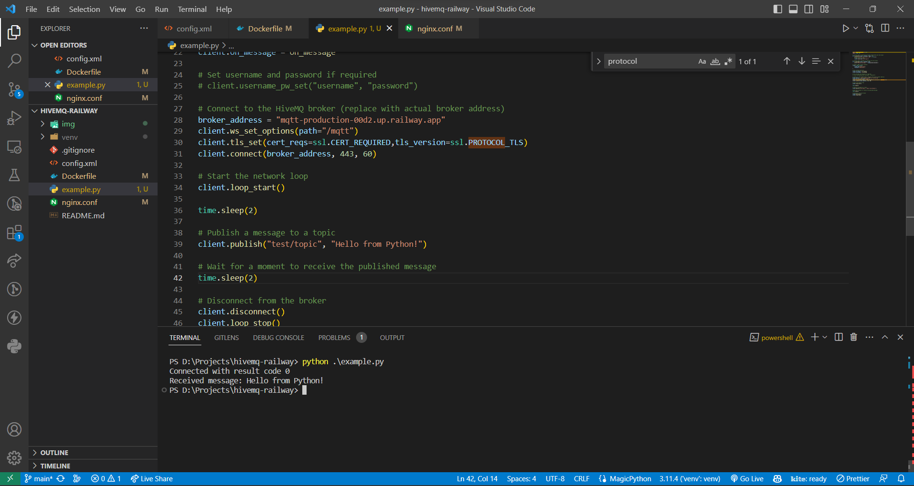
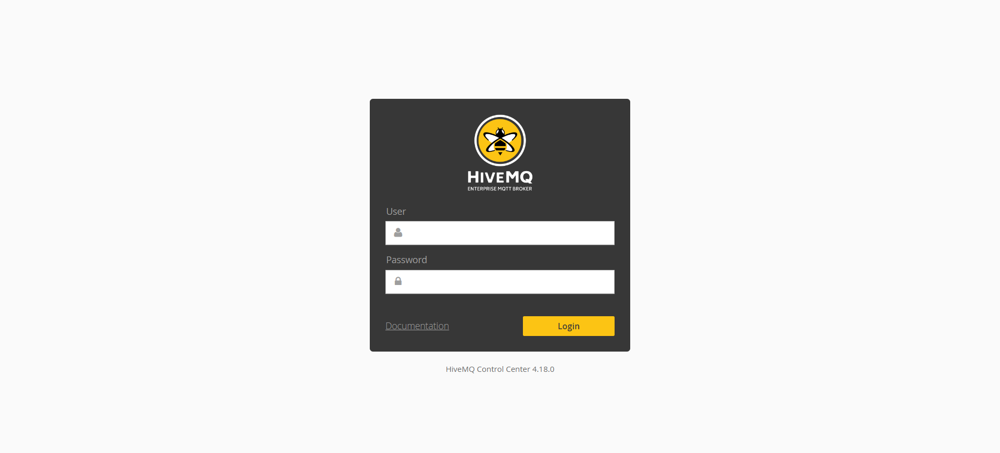
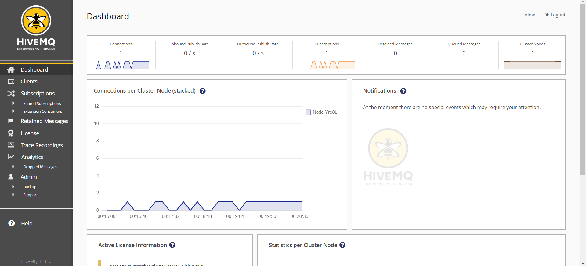
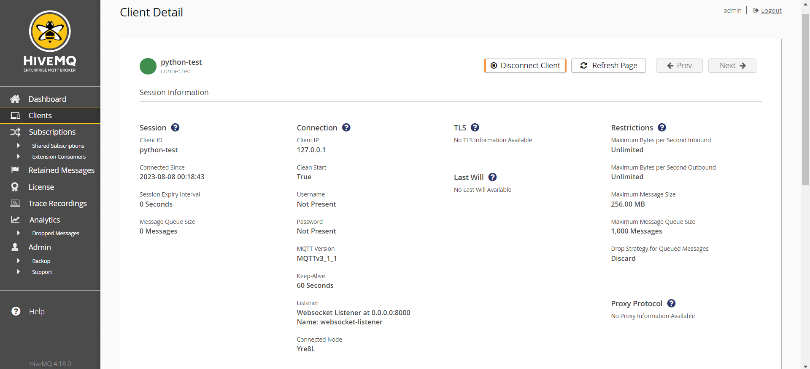
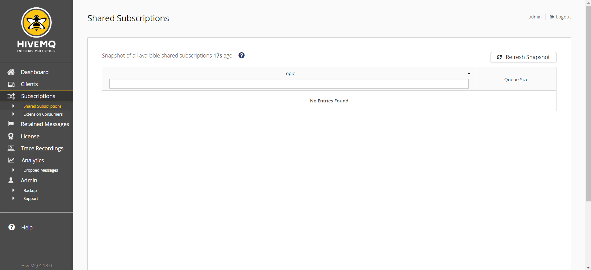
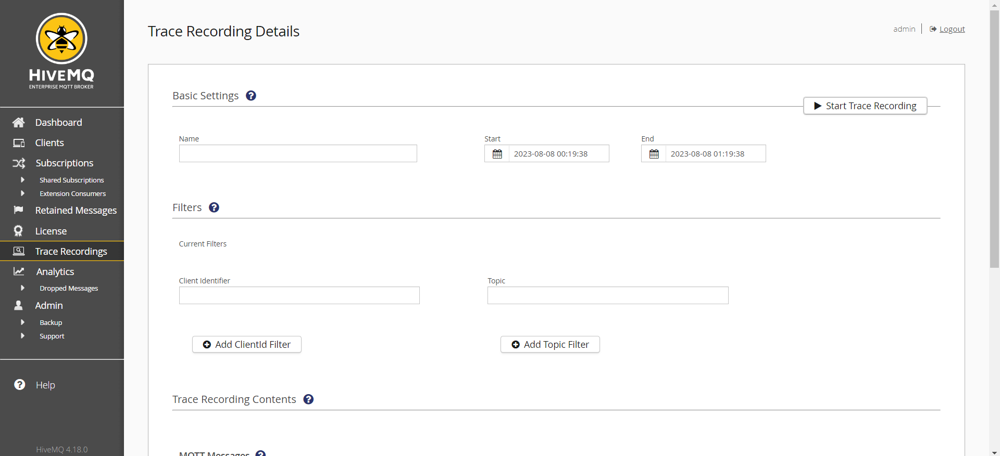
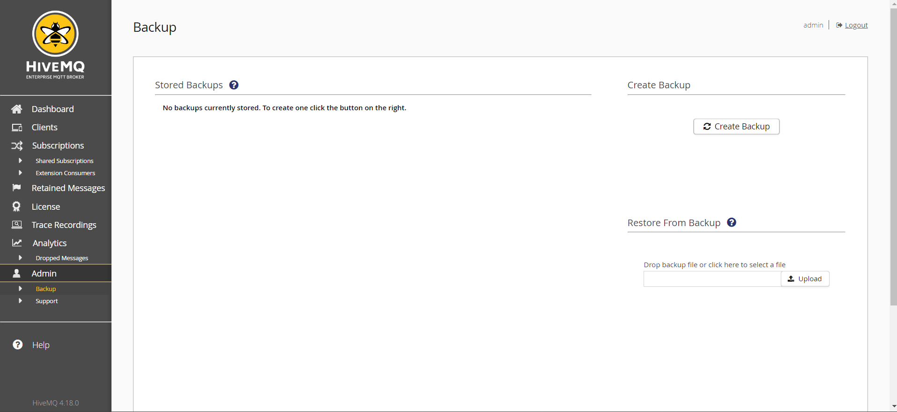

# HiveMQ - Railway Template

This example deploys a self-hosted version of [HiveMQ](https://www.hivemq.com/). 

[](https://railway.app/template/ELAarG?referralCode=HT4TtK)

## What is HiveMQ?
HiveMQ is a high-performance, enterprise-grade MQTT (Message Queuing Telemetry Transport) broker that enables seamless communication between devices and applications using the MQTT protocol. MQTT is widely used for real-time data exchange and communication in IoT (Internet of Things) applications, where low bandwidth and reliable messaging are crucial. HiveMQ provides various features and options for deploying it in high availability and clustered configurations. 

This container is based on community edition docker image and doesn't have control center feature. If you want Enterprise Edition then update the config.xml file with necessary license information and update the Dockerfile with the Enterprise Edition base image. But project is configured to work for any docker image of hiveMQ.

## Features
1. MQTT 5.0 Support: HiveMQ supports the MQTT 5.0 specification, providing advanced features such as shared subscriptions, enhanced security, message properties, and more.
2. High Performance: HiveMQ is designed for high performance and low latency, making it suitable for applications that require real-time communication.
3. Scalability: HiveMQ can be easily scaled horizontally to handle a large number of concurrent connections and messages.
4. Reliability: It ensures message delivery even in unreliable network conditions. Persistent sessions and durable message storage mechanisms prevent message loss.
5. Security: HiveMQ offers comprehensive security features, including TLS/SSL encryption, client authentication, access control, and integration with external authentication mechanisms.
6. Websockets: HiveMQ supports MQTT over WebSockets, allowing devices and applications to communicate over HTTP/HTTPS ports.
7. Advanced Clustering: HiveMQ supports clustering, enabling you to set up multiple instances that work together to provide high availability and fault tolerance.
8. Session Management: It provides flexible session management options, including session expiration, resumption, and storage.
9. Retained Messages: HiveMQ allows the broker to store the last known state of a topic, ensuring that new subscribers immediately receive the latest data.
10. QoS (Quality of Service): HiveMQ supports MQTT's QoS levels, ensuring that messages are delivered as required by the application's quality-of-service requirements.

## ✨ Services

- HiveMQ

## 💁‍♀️ How to use

- Click the Railway button 👆
- Add the required environment variables
- Deploy
- Cluster Management
    - The Template is already configured with cluster with static discovery. you can add multiple instances to the cluster by modifying the config file `config.xml` and adding the instances to the `static-discovery` section. 
    - If you look closely into `config.xml` you should see entity configured as `cluster` which is responsible for instance discovery and worker-node connectivity. You can just multiple this template service n times to get n nodes which can discover each other. Once you decide one node as master node others can be configured as worker node.
        ```xml
        <?xml version="1.0"?>
        <hivemq xmlns:xsi="http://www.w3.org/2001/XMLSchema-instance">

            ...
            <cluster>
                <enabled>true</enabled>
                <transport>
                <tcp>
                    <bind-address>0.0.0.0</bind-address>
                    <bind-port>7800</bind-port>
                </tcp>
                </transport>
                <discovery>
                    <static>
                        <node>
                            <!-- replace this IP with the hostname of service -->
                            <host>192.168.1.1</host>
                            <port>7800</port>
                        </node>
                        <node>
                            <!-- replace this IP with the hostname of another service -->
                            <host>192.168.1.2</host>
                            <port>7800</port>
                        </node>
                    </static>
                </discovery>

            </cluster>
            ...
        </hivemq>
        ```
        These Host IP address can support Railway's internal IPv6 Service discovery hostname.
    - Do follow the official docuementation for more resource and information about clustering. https://docs.hivemq.com/hivemq/4.19/user-guide/cluster

- For High Availability 
    - Once you have cluster setup you can use loadbalancer with reverse proxy between multiple nodes. HiveMQ works seamlessly with a wide range of load balancers such as HAProxy, NGINX, and others.
    - Here is one of the official documentation of configuring HAProxy https://www.hivemq.com/article/haproxy-load-balance-hivemq-using-health-api/
    - Here is another example of NGINX for proxying MQTT service with HiveMQ https://www.nginx.com/blog/nginx-plus-iot-load-balancing-mqtt/

- Custom Configuration
    - If you want to increase packet size you can just update the `config.xml`
        ```xml
        <?xml version="1.0"?>
        <hivemq xmlns:xsi="http://www.w3.org/2001/XMLSchema-instance">
            ...
            <mqtt>
                <packets>
                    <max-packet-size>268435460</max-packet-size>
                </packets>
            </mqtt>
            ...
        </hivemq>
        ```
    - You can also increase the message queue size by updating the configuration.
        ```xml
        <?xml version="1.0"?>
        <hivemq xmlns:xsi="http://www.w3.org/2001/XMLSchema-instance">

            ...
            <mqtt>
                <queued-messages>
                    <max-queue-size>1000</max-queue-size>
                    <strategy>discard</strategy>
                </queued-messages>
            </mqtt>
            ...

        </hivemq>
        ```
    - You can follow this documentation for more custom configuration https://docs.hivemq.com/hivemq/4.19/user-guide/configuration#mqtt-config

- Client Library
    - As part of this repository you should find `example.py` which demostrate the usage of official python library to use mqtt protocol to publish and subscribe to topics
    
    - There are other libraries for different programming languages and custom binaries which can interact with MQTT service like HiveMQ.
    - This is another example where you can interact with HiveMQ from browser through websockets https://www.hivemq.com/demos/websocket-client/

- HiveMQ Admin Dashboard (Enterprise version only)
    - Access HiveMQ Control Center from Railway URL
    - Use can login using default credentials `admin` and `hivemq`
    
    - You should see the dashboard with all analytics and metrics of your HiveMQ instance with connected clients and messages infomration in real-time
    
    - You can also use the MQTT Websocket client to publish and subscribe to topics
    - By default, the MQTT Websocket client is available at `https://<your-railway-url>/mqtt`
    - You can also view real-time client infomration from the HiveMQ Control Center
    
    - Also you can disconnect clients from the HiveMQ Control Center
    - HiveMQ also provides options for subcriptions and topics
    
    - Using trace functionality you can view all the messages that are published and subscribed
    
    - Finally, you can backup and restore your HiveMQ instance from the HiveMQ Control Center
    
- Enjoy 🎉

## 📝 Notes

- Source repo: https://github.com/hivemq/hivemq-community-edition
- Docs: https://docs.hivemq.com/hivemq/